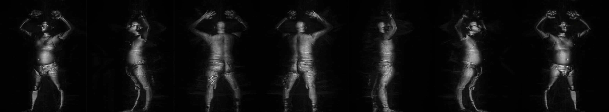
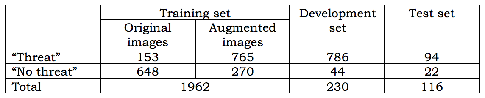
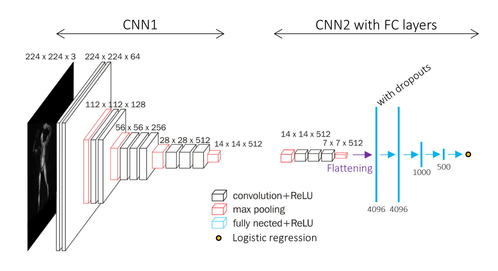
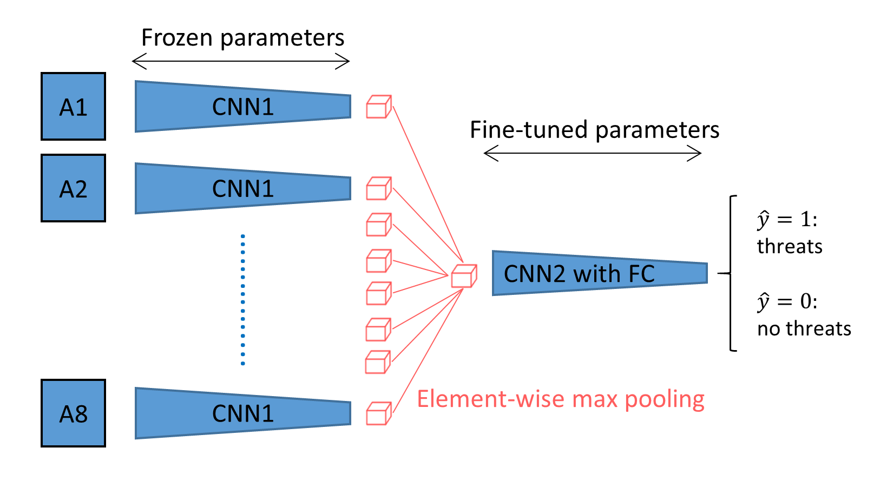
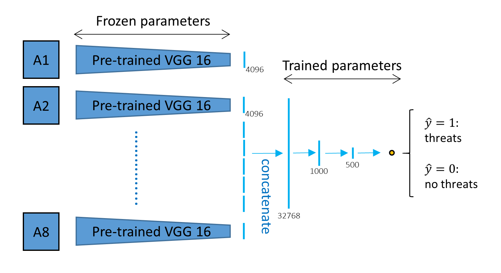
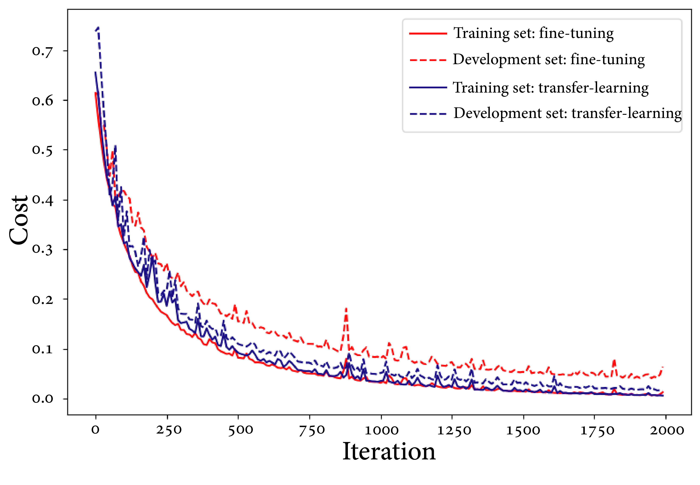
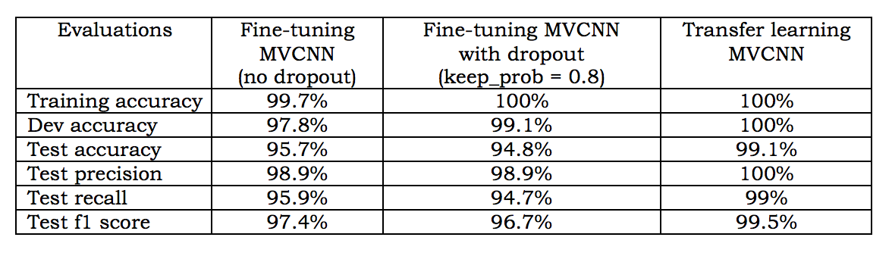

# Threats Detection for Airport Body Scan Images

Threats detection using 3D body scan images at an airport is a vital process for the safety of an air travel. Training a 3D Convolutional Neural Network (CNN) requires an extensive computation power and a large number of training examples. With our limited number of examples, we utilized a multi-view 2D CNN (MVCNN) approach using a pre-trained VGG-16 model on the ImageNet dataset. In this paper, we propose two architectures of MVCNNs to accurately detect threats from projected 2D body scan images, (1) fine-tuning later parts of the VGG-16 feature extractions and (2) training on the fully connected layers of concatenated output from transfer learning. Our models capture information from eight different angles around a body scan by (1) element-wise max pooling in fine-tuning MVCNN and (2) concatenating the output from each angle and train for more layers in transfer learning MVCNN. Both architectures yielded an accuracy higher than 95% on the test set. The predictions from the transfer learning MVCNN are slightly better than the fine-tuning MVCNN.

## Introduction
One of the most critical requirement for air travel safety is a security check at an airport. The newest technology to meet the evolving threats and achieve the highest level of transportation security is a millimeter wave scanner called the High Definition-Advanced Imaging Technology (HD-AIT) system that generates 3D full body images. The current autonomous evaluation for potential threats from scan images shows high rates of false alarm, raising a challenge for the more accurate predictions.

Utilizing the power of 3D images is one of the challenges in computer vision research. Multiple papers suggest volumetric CNN architectures on 3D surfaces for object classifications which attain good results [1,2]. However, one of the difficult tasks is a computational extensive to train on 3D images. An alternative approach is training on multiple 2D views, which surprisingly give a better result and performance [3,4]. In this project, we used projected 2D images at different angles from 3D full body scans provided by TSA and utilize the multi-view Convolutional Neural Network (MVCNN) to improve the accuracy of determining potential threats.

## Related work
Our work is inspired by the multi-view Convolution Neural Network using 2D images at multiple angles to classify a 3D object.

**Multi-View Convolutional Neural Network (MVCNN)** Su et al. [3] proposed  MVCNN to recognize and classify 3D shapes from rendered views on gray-scale 2D images. The architecture of MVCNN uses a pre-trained CNN on the ImageNet [5] and incorporate multiple views images of an object. Then, the multi-view pooling is used to combined all views together by operating the element-wise maximum pooling in order to synthesize the information from all views. Lastly, the output from multi-pooling is used as an input to the second CNN network and give the output. LeCun et al. [6] also suggested the similar methodology on stereo images. Su et al. [3] tested the number of views of rendered 2D images, and the results show that 80 views give a similar accuracy as 12 views. Qi et al. [2] improved the performance of MVCNN by data augmentation, including azimuth rotation and elevation rotation.

The MVCNN approach is also applied in high-resolution medical images. Geras et al. [7] proposed a slightly different architecture. They combined different views by concatenating them to form a fully connected layer and followed by a softmax layer for output distribution.

We realized the power of the MVCNN to recognize 3D objects in different fields and decided to use modified Su et al. [3] and Geras et al. [7] approaches to detect "threat" from full body scans.

## Dataset and Features
The dataset is provided by TSA as a part of the feature prediction competition on [Kaggle](https://www.kaggle.com/c/passenger-screening-algorithm-challenge). It includes 3D images of 1145 body scans acquired by HD-AIT system. These images are volunteers wearing different clothing types from light summer clothes to heavy winter clothes, body mass, genders, numbers of threats, and types of threats. We used projected 2D images of 3D full body scans because they have shown to dramatically outperform the classifier built directly on 3D images [3,4]. For each individual body scan, the data comprises 8 projected images that are equally spaced around a body in the vertical direction. An example of projected body scan images of a person are shown in Figure 1. These 8 images are inputs of our model. All images are gray-scale, and the resolution of each projected image is 660x512 pixels.

An example of 8 body scan images from different angle projected from a 3D body scan of a person. The third and forth pictures from the left shows a gun on the left thigh.

### Pre-processing of Body Scan Images and Augmentation
Approximately 80 percent of the dataset is labeled as a "threat" meaning that a person can have up to 3 objects on their bodies, and 20 percent is labeled as a "no-threat". We balanced the dataset by augmenting both threat and non-threat examples in the training set. The previous studies show that data augmentation improves performance and reduces overfitting in an imbalance dataset [8,9]. The augmentations include randomly translation body location in horizontal direction within the range of 100 pixels, sharpen images at random scale, randomly changing image lightness, and combination of these three augmentation methods.

Since the input of VGG-16 model is an RGB image, we converted our gray-scale projected body images into 3 bandwidths.

### Dataset Usage
The dataset is divided into training, validation, and test examples with the ratio of 70:20:10. The numbers of images in each set, including original and augmented data in training set is shown in Table 1.

Table1: The numbers of original training images, augmented training images, development images, test images.

##  Methods
Training a full 3D CNN requires an extensive computational power as well as a large number of examples. We decided to use MVCNN instead of training for full 3D CNN since our dataset comprising 1,147 three-dimensional full body scans is inadequate to fully train a new 3D CNN. MVCNN is an alternative approach to make a prediction or a classification for 3D objects by utilizing the 2D images from various angles [3,4]. Reducing the dimensions from 3D to 2D also brings an advantage of using available pre-trained 2D CNN on the ImageNet databases [5]. In this study, we utilized a pre-trained VGG16 on the ImageNet [10] and developed two types of MVCNNs, (1) fine-tuning MVCNN and (2) transfer learning MVCNN.

### Fine-tuning MVCNN
We split the VGG-16 architecture into two parts and refer them as CNN1 and CNN2 as shown in Figure 2. CNN1 starts from the input to the last conv2D group of VGG-16 model, and CNN2 starts at the last conv2D group to the feature extraction layer. We added three fully connected layers after the CNN2 and outputted the prediction from logistic regression at the end (Figure 2). We fine-tuned the CNN2 and fully connected layers by training these parts on our training set.

In CNN1 part, we used the kernel and bias parameters from the first part of pre-trained VGG-16 on the ImageNet. Each 2D body scan from an angle underwent the forward propagation of the pre-trained CNN1 providing an extracted feature cube at the dimension of 14 x 14 x 512 as shown in Figure 3. The outputs of CNN1 from all eight-angle inputs are combined by performing the multi-view pooling using element-wise max pooling operation (Figure 3). The pooled feature layer is now an input of CNN2 and fully connected layers. The parameters of CNN2 with fully connected layers are fine-tuned during the training process.

The architect of CNN1 (first part of VGG-16) and CNN2 (last Conv2D group of VGG-16) with fully connected layers. We fine-tuned the second part of CNN2 with fully connected layers with our dataset. The connection between CNN1 and CNN2 with fully connected layers is shown in Figure 3.

The architect of the fine-tuning multi-view CNN (MVCNN). The connection between CNN1 and CNN2 with fully connected layers is the element-wise maximum pooling operation.

### Transfer learning MVCNN
In contrast to the fine-tuning MVCNN, we used the kernel and bias parameters from the pre-trained VGG-16 model on the ImageNet to forward propagate the input image and get the feature extraction output as shown in Figure 4. Each input image at an angle underwent the pre-trained VGG-16, and the features were extracted to a 4096-length vector. We combined all images from different angles by concatenating the features and passed them through fully connected layers. The output prediction is determined by logistic regression (Figure 4).

The architect of the transfer learning multi-view CNN (MVCNN). The features of each picture are extracted with pre-trained VGG16 to a 4096-length vector. The features from each angles are concatenated and passed through the fully connected layers for logistic regression.

## Experiments
We used Adam optimizer ($\beta_1 = 0.9$, $\beta_2 = 0.999$, $\epsilon$ = $1\mathrm{e}{-8}$) and tested several hyperparameters:
- **Learning rate ($\alpha$)**: We tested the range of 0.1 to $1\mathrm{e}{-6}$ and found that the $\alpha$ = $1\mathrm{e}{-5}$ was the best value to balance between avoid overshooting and slow convergence
- **Mini-batch size**: We tested a range of 124 to 1024 examples in a mini-batch and found that the size of 512 was the best for smoothing the learning curves and avoid getting stuck at the saddle point.
- **Number of fully connected layers**: We tested adding and removing one fully connected layer. The results were relatively unchanged.
- **Number of epoch**: We tested a range of 500 to 3000 epoches and found that 2000 epoches were enough for convergence (Figure 5)
- **Keep-prob in dropout**: We tested a range of 0.4 to 1.0 for keep-prob value in dropout regularization. The results were relatively unchanged.

## Results and Discussion
The overall results from two MVCNN architectures are highly satisfied as they achieve more than 95% accuracy in training, development, and test sets (Table 2). We evaluate our models in multiple ways, including accuracy,  precision, recall, and f1 scores. The predictions from the transfer learning are better than the fine-tuning MVCNN's in all of the evaluation methods.

**Error Analysis** We analyzed the mis-prediction in the dev and test sets and found that most of the miss-prediction came from noisy scanned image or a person with abnormal knee or angle appearances.

The learning curves of the fine-tuned (red) and transfer learning (blue) MVCNN. Each MVCNN has the costs of the training (solid) and development (dash) after each tens epoch.

Table 2: Summary of predictions results for each type of MVCNN.

## Conclusion and Future Work
We implemented fine-tuning and transfer learning multi-view CNN (MVCNN) to detect potential threats from body scan images at an airport. The results show that predictions from the transfer learning MVCNN are slightly better than the fine-tuning MVCNN's. This might be due to a limited number of examples to fine-tuning the CNN model. We wish to explore other regularization methods, such as batch norm or weighted cross entropy in the future work to handle the imbalanced data.

**Acknowledgement**
This work is a collaboration with Chayawan Jaikla (@cjaikla)

We acknowledge helps from Patrick Cho, Navi Tansaraviput, and Pin Pin Tea-mangkornpan for advises and suggestions.

**References**

[1] We, Z & Song, S. & Khosla, A. & Yu, F & Zhang, L. & Tang, X & Xiao, J. (2015) In *Proceedings of the IEEE conference on computer vision and pattern recognition* (pp. 1912-1920).

[2] Jackson, A. S. & Bulat, A. & Argyriou, V.& Tzimiropoulos, G. (2017, October). Large pose 3D face reconstruction from a single image via direct volumetric CNN regression. In *Computer Vision (ICCV), 2017 IEEE International Conference* (pp. 1031-1039). IEEE.

[3] Su, H. & Maji S. & Kalogerakis, E. & Learned-Miller, E. (2015) Multi-view Convolutional Neural Networks for 3D shape Recognition. *2015 IEE International Conference on Computer Vision*.

[4] Qi, C. R. & Su, H. & Nießner, M. & Dai, A., Yan, M., & Guibas, L. J. (2016). Volumetric and multi-view cnns for object classification on 3d data. In *Proceedings of the IEEE conference on computer vision and pattern recognition* (pp. 5648-5656).

[5] J. Deng, W. Dong, R. Socher, L.-J. Li, K. Li, & L. Fei- Fei (2009) Imagenet: A large-scale hierarchical image database. In *CVPR 2009*, pages 248–255. IEEE.

[6] LeCun, Y., Huang, F. J., & Bottou, L. (2004). Learning methods for generic object recognition with invariance to pose and lighting. In *Computer Vision and Pattern Recognition, 2004. CVPR 2004. Proceedings of the 2004 IEEE Computer Society Conference* (Vol. 2, pp. II-104). IEEE.

[7] Geras, K. J., Wolfson, S., Shen, Y., Kim, S., Moy, L., & Cho, K. (2017). High-resolution breast cancer screening with multi-view deep convolutional neural networks. *arXiv preprint arXiv:1703.07047*.

[8] Thai-Nghe, N. & Busche, A. & Schmidt-Thieme, L. (2009) Improving Academic Performace Prediction by Dealing with Class Imbalance. *2009 Ninth International Conference on Intelligent Systems Design and Applications*.

[9] Ahmed, E., Jones, M., & Marks, T. K. (2015). An improved deep learning architecture for person re-identification. In *Proceedings of the IEEE Conference on Computer Vision and Pattern Recognition* (pp. 3908-3916).

[10] Ahmed, E., Jones, M., & Marks, T. K. (2015). An improved deep learning architecture for person re-identification. In *Proceedings of the IEEE Conference on Computer Vision and Pattern Recognition* (pp. 3908-3916).

[11] Abadi, M., Barham, P., Chen, J., Chen, Z., Davis, A., Dean, J., ... & Kudlur, M. (2016, November). TensorFlow: A System for Large-Scale Machine Learning. In *OSDI* (Vol. 16, pp. 265-283).

[12] Chollet, F. (2015) keras, GitHub. https://github.com/fchollet/keras

[13] Pedregosa et al. (2011) Scikit-learn: Machine Learning in Python *JMLR 12* (pp. 2825-2830).
